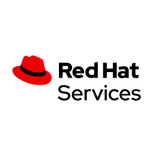

Return to the <a href="https://project-herophilus.github.io/Project-Herophilus-Assets/" target="_blank">Main Page</a>

# intelligent DaaS Partner Implementations
iDaaS is enabling organizations to make data a product and build assets on top of it. Because <b>"Data is the asset!!!"</b> iDaaS is about enabling information for knowledge that can be used for action in a secure and scalable manner. Along with helping organizations it is also being used and adopted by numerous system integrators. Since doing our first release in May of 2020 we have so appreciated those customers and systems integrators that have implemented their solutions and solution offerings powered with iDaaS.

|Vendor|Image|
|---|---|
|Blue Prism||   
|IBM Global Business Services||   
|Mobia||  
|Parkar Consulting||
|Perficient ||
|Prolifics||
|Perspecta||   
|TekSystems||
|Red Hat||   
|Red Hat Services||   

We will continue to maintain this page periodically as we are working with numerous healthcare payers and providers actively on iDaaS implementations and offerings.

